# Day 39 – What is CI/CD?

## Task 1: The Problem with Manual Deployments

### What can go wrong when 5 developers manually deploy?

1. **Merge conflicts at deployment time** — Two devs push to production at the same time. One overwrites the other's changes. Nobody knows until users report a bug.
2. **Environment drift** — Dev A deploys from her laptop (Python 3.10, lib v2.1). Dev B deploys from his (Python 3.9, lib v1.8). Same codebase, different behavior in production.
3. **No deployment log** — If production breaks at 3am, nobody knows which commit caused it or who deployed it.
4. **Human error** — Forgot to run migrations. Deployed the wrong branch. Skipped tests because "it looked fine."
5. **Deployment bottleneck** — Only one senior dev knows the deployment procedure. Everyone waits on them.

### "It works on my machine" — why it's a real problem

This phrase means: the software runs correctly on the developer's local computer but fails in another environment (staging, production, a teammate's machine).

Root causes:
- Different OS versions or missing system libraries
- Different versions of dependencies
- Environment variables set locally but not documented
- Local database has seed data that production doesn't have

This is a **real production risk** — a bug that can't be reproduced is a bug that can't be fixed. CI/CD solves this by building and testing in a clean, identical environment every single time.

### How many times can a team safely deploy manually?

Realistically: **1-2 times per day, at most**. Manual deployments are slow (30-60 min), error-prone, and require people to be online and available. Many teams end up doing it weekly or even less. CI/CD teams at places like Amazon deploy **thousands of times per day** safely — because the pipeline handles it automatically.

---

## Task 2: CI vs CD vs CD

### Continuous Integration (CI)

Every time a developer pushes code, it is automatically merged into the shared codebase and tested. The pipeline builds the app and runs unit tests, integration tests, and linting — usually within minutes. CI **catches bugs early**, before they compound. If a test fails, the push is rejected and the developer is notified immediately.

**Real-world example**: A developer opens a pull request on GitHub. GitHub Actions automatically runs `pytest` and `eslint`. If any test fails, a red ✗ appears on the PR and it cannot be merged until it's fixed.

---

### Continuous Delivery (CD — Delivery)

Everything CI does, **plus**: the app is automatically built into a deployable artifact (a Docker image, a JAR file, a ZIP) and placed in a staging environment — ready to deploy to production with a single click. The key word is *ready*. A human still approves the final push to production.

**Real-world example**: After all tests pass, the pipeline builds a Docker image, pushes it to Docker Hub, and deploys it to a staging server. A product manager reviews the staging environment and clicks "Approve" to release to production.

---

### Continuous Deployment (CD — Deployment)

Identical to Continuous Delivery, **except**: there is no manual approval step. Every commit that passes all tests is automatically deployed to production. This requires very high confidence in your test suite.

**Real-world example**: Netflix uses continuous deployment. A code change pushed by an engineer that passes all automated tests is live in production for users within hours — no one clicks "deploy."

**When do teams use it?** Startups that need to move fast, mature teams with comprehensive test coverage, SaaS products where small incremental changes are low risk.

---

## Task 3: Pipeline Anatomy

| Term | What It Does |
|------|-------------|
| **Trigger** | The event that starts the pipeline — a `git push`, a PR being opened, a scheduled cron job, or a manual button click. |
| **Stage** | A logical phase of the pipeline that groups related work. Common stages: `test`, `build`, `deploy`. Stages run in sequence — if one fails, the next doesn't start. |
| **Job** | A unit of work inside a stage. A `test` stage might have three jobs: `lint-job`, `unit-test-job`, `integration-test-job`. Jobs inside the same stage can run **in parallel**. |
| **Step** | A single command or action inside a job. For example, inside `unit-test-job`: step 1 = `pip install -r requirements.txt`, step 2 = `pytest tests/`. |
| **Runner** | The virtual machine or container that actually executes the job. GitHub Actions uses cloud VMs (Ubuntu, Windows, macOS). You can also use self-hosted runners on your own server. |
| **Artifact** | The output produced by a job that can be passed to the next stage. Examples: a compiled binary, a Docker image, a test coverage report, a ZIP archive. |

---

## Task 4: Pipeline Diagram

> Scenario: A developer pushes code to GitHub → app is tested → built into a Docker image → deployed to staging.

```
┌─────────────────────────────────────────────────────────────────────┐
│                        CI/CD PIPELINE                               │
│                                                                     │
│  [TRIGGER]──►[TEST STAGE]──────►[BUILD STAGE]──────►[DEPLOY STAGE] │
│                                                                     │
│  git push    ┌─────────────┐    ┌─────────────┐    ┌────────────┐  │
│  to main     │ lint-job    │    │ docker-      │    │ ssh-deploy │  │
│              │ unit-test   │    │ build-job    │    │ -job       │  │
│              │ security-   │    │ docker-push  │    │ smoke-test │  │
│              │ scan-job    │    │ -job         │    │ -job       │  │
│              └─────────────┘    └─────────────┘    └────────────┘  │
│               (jobs parallel)    artifact: image    to staging env  │
└─────────────────────────────────────────────────────────────────────┘

RUNNER: GitHub-hosted Ubuntu VM executes all jobs
ARTIFACT: Docker image stored in Docker Hub between Build and Deploy
```

**Stage breakdown:**

1. **Trigger** — Developer runs `git push origin main`. GitHub detects the push event and fires the workflow.

2. **Test Stage** — Three jobs run in parallel on the runner:
   - `lint-job`: `flake8 .` — catches syntax and style errors
   - `unit-test-job`: `pytest tests/unit/` — runs all unit tests
   - `security-scan-job`: `bandit -r .` — scans for known vulnerabilities
   - If any job fails → pipeline stops, developer gets notified.

3. **Build Stage** — Two sequential jobs:
   - `docker-build-job`: `docker build -t myapp:latest .` — creates the image
   - `docker-push-job`: `docker push myregistry/myapp:latest` — pushes to registry
   - **Artifact produced**: Docker image tagged with the commit SHA.

4. **Deploy Stage** — Three sequential jobs:
   - `ssh-deploy-job`: SSHes into staging server, pulls the new image, restarts the container
   - `smoke-test-job`: Hits the `/health` endpoint — confirms the app actually started
   - `notify-slack-job`: Posts "✅ Deployed myapp v1.4.2 to staging" to #deployments

---

## Task 5: Real-World Pipeline Exploration — FastAPI

**Repo**: [tiangolo/fastapi](https://github.com/tiangolo/fastapi)  
**File explored**: `.github/workflows/test.yml`

| Property | What I Found |
|----------|-------------|
| **Trigger** | `push` to `master`, any `pull_request` targeting `master` |
| **Number of jobs** | ~4 jobs (`lint`, `test`, `coverage`, `publish-docs`) |
| **What it does** | Runs `mypy` for type checking, `pytest` with coverage across multiple Python versions (3.8 → 3.12) using a matrix strategy. Coverage reports are sent to Codecov. Documentation is rebuilt and published on merge. |

**Interesting finding**: FastAPI uses a **matrix build** — the same test job runs 5 times simultaneously, once for each Python version. This ensures the library works for all supported Python versions before merging. This would take 5x as long manually; the pipeline runs them all in parallel in about the same wall-clock time as one.

---

## 3 Key Learnings

1. **CI/CD is a practice, not a tool.** GitHub Actions, Jenkins, GitLab CI, and CircleCI all implement the same concepts: trigger → stages → jobs → steps → artifact. Understanding the anatomy means you can work in any of them.

2. **A failing pipeline is success, not failure.** The entire point of CI is to catch bugs before they reach production. When a pipeline fails, it's doing exactly what it was designed to do — stopping a bad change from going live. The problem is the bug, not the pipeline.

3. **The difference between Delivery and Deployment is trust.** Continuous Delivery = automated up to staging, human approves prod. Continuous Deployment = fully automated end to end. Which one a team chooses depends entirely on their confidence in their test suite. Both are valid — the wrong answer is no automation at all.

---
